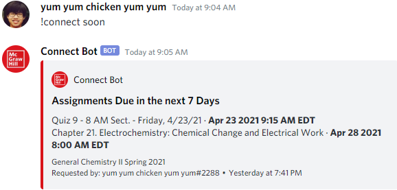

# Connect Bot

This bot makes it easier for students to check upcoming assignments on the popular Connect platform from McGraw Hill Education. No copyright infringement was intended in the creation of the bot and all trademarks are owned by their respective owners. This bot should be used for educational purposes only.

## Dependencies

- Node.js
- Discord.js
- Puppeteer

## Setup

This bot was meant to be hosted on Heroku or another cloud hosting service. If you want to host this bot locally, replace the process.env variables with your token, email, password, and the class(es) you are currently taking.

**The bot also requires the permissions to manage messages on whichever server it is put on.**

## Bot Preview

## Problems Encountered

Heroku doesn't seem to update the Date object when new requests are issued. As a result, the setTimestamp field for embed messages are left with the time when the server last restarted rather than the time the command was issued. When hosting locally, the bot doesn't encounter this issue.

## Future Development

Since the bot is currently being deployed on Heroku, there are no plans for me to add a reminder system since Heroku Free Tier doesn't provide persistent storage. Once I obtain a different method for deployment, I look forward to implementing:

- Schedule Reminders
- Direct Message people within servers and change time zones based on preferences
